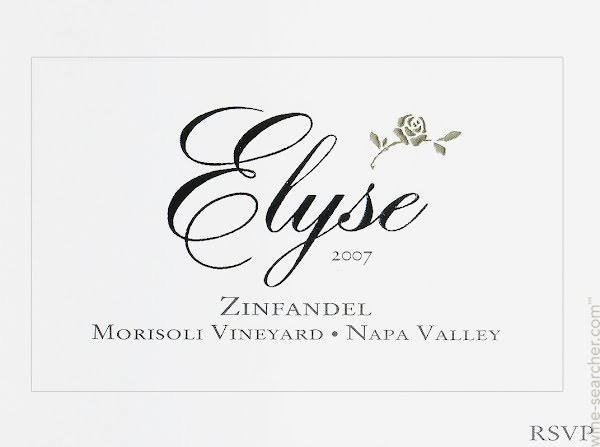
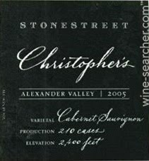
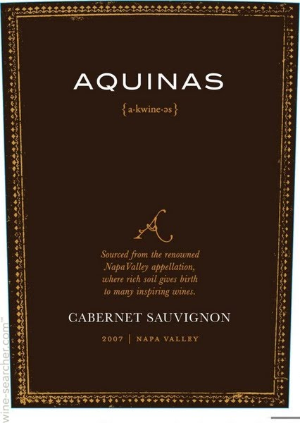
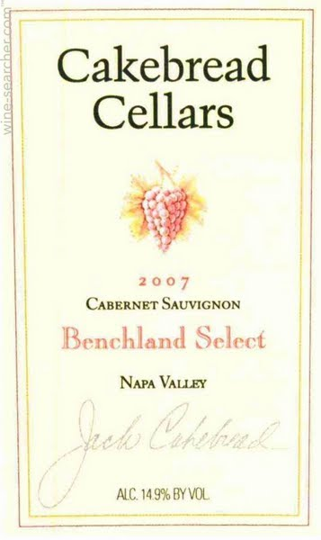
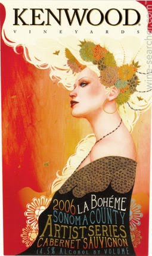
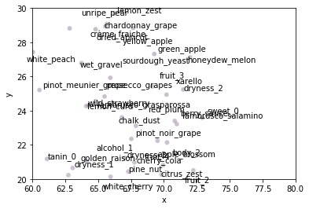
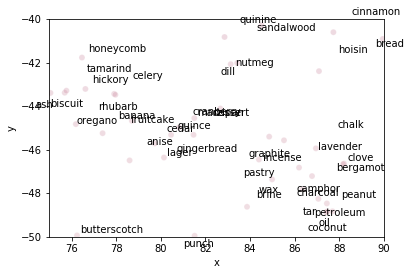
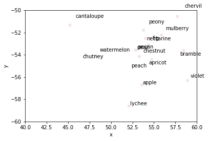

# Wine Recommendation Based on Flavors

What's the best substitute for a particular bottle? This is perhaps one of the most asked questions when people do wine shopping. While it is agreed upon that a 2009 red-blend from Margaux is a true gem, it certainly has a price to match. Many people might sought a more affordable alternative: perhaps a vintage wine from a later year in the same chateau, a red-blend from the same year but a less prestiged area such as Pays D'oc, or a bottle from a completely different continent that has a similar taste. This exploratory project provides a solution where an appropriate substitute is determined by multiple factors: appellations, grape variety, country and most importantly, its taste.

Consider the following vineyard:

 

The closest substitute of their 2012 productions --'Elyse 2012 Morisoli Vineyard Zinfandel (Rutherford)'.-- is the following

|         |             | | |
| --- |---| --- | --- |
| Stonestreet 2006 Christopher's Cabernet Sauvignon (Alexander Valley)* | Aquinas 2014 Cabernet Sauvignon (Napa County-Sonoma County-Lake County)* | Cakebread 2012 Benchland Kenwood 2010 Artist* |Series Cabernet Sauvignon (Sonoma County)* |

*All pictures are from https://www.wine-searcher.com/

This document will briefly explain the following:

  - [Installation](#installation)
  - [Data Description](#Data-Description)
  - [Methodology](#Methodology)
  - [Findings](#Findings)
  - [Further Studies](#Further-Studies)
  
### Installation
----------------------------------
##### Source Data 
  - Self-made notes based on [Wine Folly](wine_folly)
  - [Kaggle](kaggle)
  
##### Download Intermediate Data to run the notebooks
- all the pickle files in the folder "pkl_data"

##### Install the Requirements
  Install the requirements using ```pip install -r requirements.txt```
  
  The following third-party packages are essential for this project:
   - [Instruction on installing glove-python](glove_python)
  (Technical reference on the GloVe model can be found [here](GloVe))
   

Please refer to the links above if you run into any problems.

### Data Description
----------------------------------

##### Notes from Wine Folly (NWF)
  The following factors are summarized in a spreadsheet:
  - Wine variety
  - Places where its produced/grown
  - Properties (e.g., levels of dryness)
  - Possible Flavor Profiles 
   
##### Wikipedia(Wiki)
   For each of the possible flavors in the notes above, details are added to the learning process based on their wikipedia profile
   
#####  Online Review (OR)
   This data is from Kaggle and is originally a scrapped source from [WineEnthusiast](winewag).
   The columns in use for this projects are "title","variety", "country" and "description". The last column is a short paragraph of review by a sommelier.
   

### Methodology
----------------------------------
##### Files
- Wine_Note_Wiki_Learning.ipynb
- Wine_OnlineReview_Learning

##### GloVe Model
- The project replies heavily on the GloVe Model where a vector is assigned to a word based on its context (or 'corpus')
- 3 layers of information are added to the corpus to enrich its understanding of a particular flavor: NWF, Wiki and OR (details have been mentioned above). 
  - NWF sets the foundation of the model's wine knowledge so that it acknowledges that the boundaries of varieties: for example, Chardonnay and Merlot can never be similar due to their distinct flavors as well as the difference of the grapes used. It also sets forward some possible linkage between the same category of wines: for instance, Cabernet Sauvignon and Bordeaux Blend, thought different varieties, could be similar due to their widely overlapping flavors. 
  - Wikipedia page on the flavors helps to define similar tastes closer. For example, after learning from Wiki, peach, apricot and nectarine became close neigbors.
  
  Here's some results after learning from NWF and Wiki:
  
  
  
  
  
  
  
  -OR provides specific information on a particular bottle. This is the main subject to learn. Knowledge learnt from NWF and Wiki adds value to this final stage of unsupervised learning.

##### Distance Function
- Both Euclidean and Cosine Distance are used. They both provide reasonable results. However, it is noted that when less information are presented, cosine delivers a more consistent answer.

### Findings
----------------------------------

The algorithm works quite well. For the examples tested, it is always able to find a substitute of either the same kind of the wine or a possible kind that can have similar flavors (e.g, Zinfindel and Cabernet Sauvignon in the beginning of this document). The substitute is often from the same region and usually from the same year. The flavors are also similar, as expected.


### Further Studies
----------------------------------
- A better criteria to experiment the algorithm and see if it's effective (maybe A/B testing)
- A more recent dataset by running the scrapper
- Add the details of different Vineyard from Wikipedia might help

[//]: # 


   [wine_folly]: https://www.amazon.com/Wine-Folly-Essential-Guide/dp/1592408990/ref=sr_1_2?crid=4KTQHE67IH5R&keywords=wine+folly&qid=1574797120&sprefix=wine-folly%2Caps%2C125&sr=8-2
   [glove_python]: https://github.com/maciejkula/glove-python/wiki/Installation-on-Windows
   [GloVe]: https://nlp.stanford.edu/projects/glove/
   [kaggle]: https://www.kaggle.com/sudhirnl7/wine-recommender
   [winewag]: https://www.winemag.com/?s=&drink_type=wine
